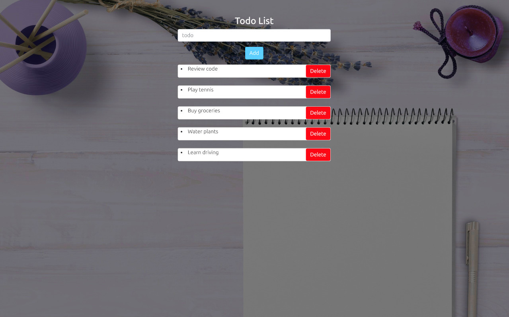

# Django ToDo List App




## Table of Contents

- [Introduction](#introduction)
- [Features](#features)
- [Requirements](#requirements)
- [Installation](#installation)
- [Project Structure](#project-structure)
- [Contributing](#contributing)
- [License](#license)

## Introduction

This is a Django ToDo List app that helps you manage your tasks efficiently. You can create tasks as well as delete them when completed.

## Features

- Create and delete ToDo tasks
- Responsive frontend with Bootstrap

## Requirements

- Python 3.8+
- Django 3.2+
- SQLite (default database, can be changed)

## Installation

Follow these steps to get a development environment running.

1. **Clone the repository:**

   ```bash
   git clone https://github.com/jaman-dci/django-todo-app
   cd django-todo-app
   ```

2. **Create and activate a virtual environment:**

   ```bash
   python3 -m venv venv
   source venv/bin/activate
   # On Windows use
   venv\Scripts\activate
   ```

3. **Install the required packages:**

   ```bash
   pip install -r requirements.txt
   ```

4. **Set up the database:**

   ```bash
   python manage.py migrate
   ```

5. **Run the development server:**

   ```bash
   python manage.py runserver
   ```

6. **Access the application:**

   Open your web browser and navigate to `http://127.0.0.1:8000`.


## Project Structure

```
django-todo-app/
├── LICENSE
├── manage.py
├── mytodo
│   ├── asgi.py
│   ├── __init__.py
│   ├── settings.py
│   ├── urls.py
│   └── wsgi.py
├── README.md
├── requirements.txt
└── todo
    ├── admin.py
    ├── apps.py
    ├── forms.py
    ├── __init__.py
    ├── migrations
    │   ├── 0001_initial.py
    │   └── __init__.py
    ├── models.py
    ├── templates
    │   └── index.html
    ├── tests.py
    ├── urls.py
    └── views.py
```

## Contributing

Contributions are welcome! Please follow these steps:

1. Fork the repository.
2. Create a new branch: `git checkout -b my-feature-branch`.
3. Make your changes and commit them: `git commit -m 'Add new feature'`.
4. Push to the branch: `git push origin my-feature-branch`.
5. Submit a pull request.

Please ensure your code adheres to the project's coding conventions.

## License

This project is licensed under the GNU GENERAL PUBLIC LICENSE. See the [LICENSE](LICENSE) file for more details.

```
Feel free to customize this template according to the specifics of your Django ToDo List App.
```
